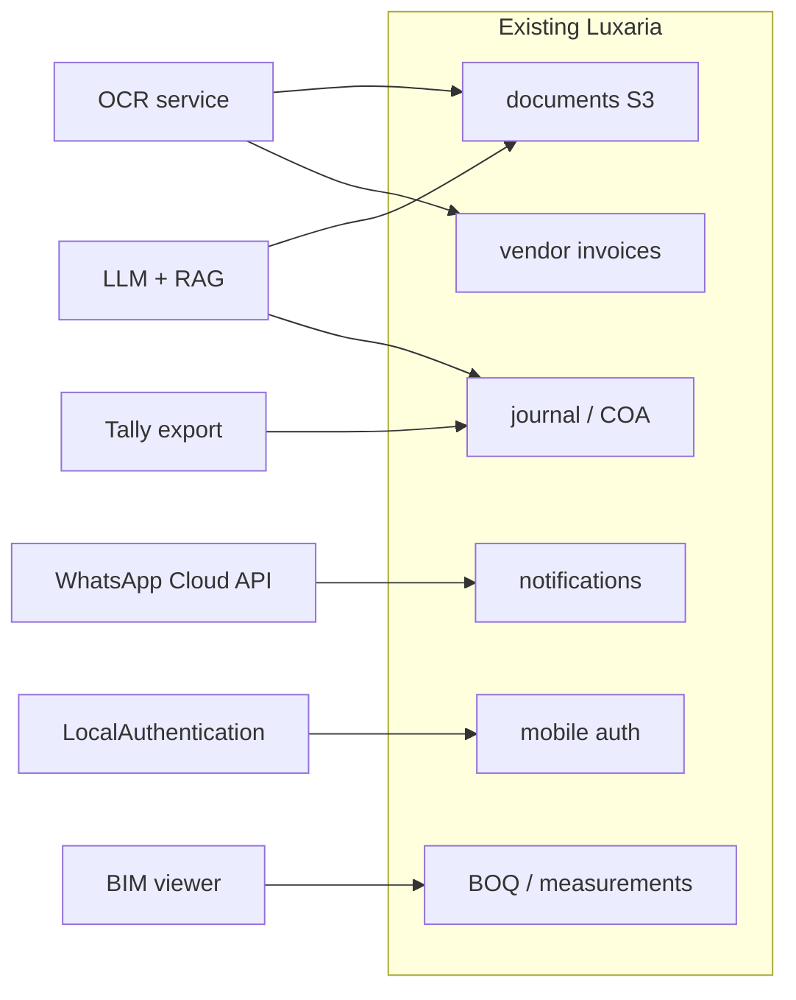

# Advanced Controls Roadmap — Discovery Document

**Micro Phase 141** — capability discovery only. No production features, no AI/accounting logic changes.

This document evaluates six advanced control areas against the **current Luxaria codebase** (detached HEAD audit, July 2026). It is intended for product and engineering planning before any implementation phase.

## Scope and method

- **In scope:** OCR, Tally ERP sync, WhatsApp notifications, device biometrics, BIM integration, and AI-assisted workflows.
- **Out of scope:** Shipping features, modifying journal posting rules, or embedding LLM calls in accounting modules.
- **Evidence:** Repo paths cited below were inspected for stubs, APIs, permissions, and data models. See also [`docs/ui-api-matrix.md`](./ui-api-matrix.md) for the full module map.

## Executive summary

| Capability | Repo readiness | Recommended next step | Pilot? |
|------------|----------------|----------------------|--------|
| OCR (invoice / voucher capture) | **Medium** — documents + AP pipeline exist; no OCR service | Shadow-mode extraction on vendor invoices | **Yes** — 1 project, finance team |
| Tally sync | **Low** — native GL is source of truth; no export stub | Discovery workshop + XML/JSON mapping spec | **No** — spec first |
| WhatsApp | **High stub** — channel + prefs wired; provider missing | Meta Cloud API pilot for 2 event types | **Yes** — opt-in users only |
| Biometrics | **Low** — JWT + SecureStore only; no LocalAuthentication | Mobile unlock + session re-auth pilot | **Yes** — mobile site supervisors |
| BIM | **None** — BOQ/measurements are 2D text refs | Viewer + quantity takeoff RFP | **No** — vendor evaluation first |
| AI assistants | **None** — no LLM modules or prompts | Read-only RAG over API docs + reports | **Yes** — internal admin, no writes |

---

## Existing codebase anchors

These paths are the natural integration surfaces. None of the six capabilities are fully implemented today.

### Notifications (WhatsApp, push, email)

| Path | Role |
|------|------|
| `apps/backend/src/modules/notifications/channels/whatsapp.channel.ts` | WhatsApp **placeholder** — skips delivery, records `whatsapp_placeholder` meta |
| `apps/backend/src/modules/notifications/channels/push.channel.ts` | Push **stub** — logs and returns synthetic message id |
| `apps/backend/src/modules/notifications/channels/email.channel.ts` | Email **stub** — logs subject/body preview |
| `apps/backend/src/modules/notifications/notifications.dispatcher.ts` | Channel routing; WhatsApp **off by default** unless user enables |
| `apps/backend/src/modules/notifications/notifications.constants.ts` | `NotificationChannel.WhatsApp`, event types (e.g. `payment_overdue`, `approval_pending`) |
| `apps/backend/src/modules/notifications/notifications.module.ts` | BullMQ queue when Redis enabled |
| `apps/backend/src/modules/rbac/permissions.catalog.ts` | Notification permissions (in-app / push / email / WhatsApp) |
| `apps/mobile/src/notifications/pushNotifications.ts` | Expo push token fetch; **server registration not implemented** |

### Documents and capture (OCR candidates)

| Path | Role |
|------|------|
| `apps/backend/src/modules/documents/documents.service.ts` | Presign → confirm → download; `malwareScanStatus` lifecycle |
| `apps/backend/src/modules/documents/schemas/document.schema.ts` | Versioned S3 metadata, entity linkage |
| `apps/backend/docs/DOCUMENTS_S3_API.md` | Upload flow, MIME allowlist, max 25MB |
| `apps/mobile/src/utils/fileUpload.ts` | Mobile upload helper |
| `apps/backend/docs/VENDOR_INVOICES_API.md` | Manual invoice entry workflow |
| `apps/backend/docs/THREE_WAY_MATCHING.md` | PO ↔ GRN ↔ invoice validation (post-OCR target) |

### Accounting (Tally sync candidates)

| Path | Role |
|------|------|
| `apps/backend/src/modules/journal/journal.service.ts` | Posted double-entry; FY lock; audit hooks |
| `apps/backend/docs/JOURNAL_API.md` | Journal statuses, dimensions (`boqItemId`, `partyId`, …) |
| `apps/backend/docs/CHART_OF_ACCOUNTS_API.md` | COA hierarchy and posting rules |
| `apps/backend/src/modules/chart-of-accounts/` | Account dimension enforcement |
| `apps/backend/src/modules/bank-reconciliation/` | Bank statement import/match (parallel to Tally bank books) |
| `apps/backend/src/modules/accounting-reports/` | TB / GL exports (Excel/PDF patterns exist in web reports) |

### Site / construction (BIM candidates)

| Path | Role |
|------|------|
| `apps/backend/docs/BOQ_API.md` | Block → floor → category → item hierarchy |
| `apps/backend/docs/WORK_MEASUREMENTS_API.md` | `drawingReference`, photo document ids, BOQ cumulative caps |
| `apps/backend/docs/LABOUR_ATTENDANCE_API.md` | GPS + group photos on submit |
| `apps/mobile/src/screens/DailyProgressReportScreen.tsx` | Field capture (offline-capable) |

### Auth (biometrics candidates)

| Path | Role |
|------|------|
| `apps/backend/docs/AUTH_API.md` | Argon2id, refresh rotation, device session fields |
| `apps/mobile/src/auth/tokenStorage.ts` | `expo-secure-store` for tokens |
| `apps/mobile/src/screens/LoginScreen.tsx` | Email/mobile + password only |
| `apps/mobile/src/auth/AuthContext.tsx` | Session hydration; no biometric gate |

### AI

No `openai`, `anthropic`, embedding, or prompt modules exist under `apps/backend` or `apps/web`. Any AI work starts net-new behind a feature flag and must not auto-post journals or approve payments.

---

## Capability matrix

Legend: **Risk** (operational / compliance impact if wrong), **Cost** (build + run, relative), **Deps** (external systems), **Privacy** (PII / sensitive data exposure).

| Dimension | OCR | Tally | WhatsApp | Biometrics | BIM | AI |
|-----------|-----|-------|----------|------------|-----|-----|
| **Business value** | High — reduces AP data entry | High — statutory books overlap | Medium — field alerts | Medium — mobile UX + device trust | Medium — quantity disputes | High — insights; high misuse risk |
| **Technical risk** | Medium — extraction errors → bad match/pay | **High** — dual ledger drift | Medium — template/policy compliance | Low–medium — local-only unlock | **High** — model fidelity, viewer perf | **High** — hallucination on financials |
| **Cost (build)** | Medium (service + review UI) | **High** (mapping, reconciliation UI) | Low–medium (Meta BSP + templates) | Low (Expo LocalAuthentication) | **High** (viewer + sync pipeline) | Medium (RAG infra + guardrails) |
| **Cost (run)** | Per-page OCR + storage | Tally licenses + sync jobs | Per-conversation Meta fees | Negligible | Storage + CDN + vendor seats | Token + vector DB |
| **Dependencies** | AWS Textract / Google Doc AI / Azure Form Recognizer | Tally Prime XML/ODBC/API (version-specific) | Meta WhatsApp Business Cloud API | Apple Face ID / Android BiometricPrompt | Autodesk Forge / IFC.js / Trimble | LLM provider, optional vector store |
| **Privacy / compliance** | Invoice scans = vendor GSTIN, amounts | Full GL export = entire company finances | Mobile numbers, message content | **Biometric data stays on device**; session tokens in SecureStore | Model files may contain unit layouts | Prompts may leak project/customer data |
| **Repo dependency** | Documents, vendor invoices, 3-way match | Journal, COA, FY lock, audit log | Notifications module (ready) | Mobile auth stack | BOQ, work measurements | Audit log, reports (read-only) |
| **Pilot recommendation** | **Go** — shadow OCR, human confirm | **Hold** — mapping doc + accountant sign-off | **Go** — 2 templates, opt-in | **Go** — unlock only, no password replacement | **Hold** — vendor PoC | **Go** — internal Q&A, no writes |

---

## Per-capability detail

### 1. OCR (vendor invoices, vouchers, KYC)

**Problem:** Finance manually keys vendor invoice lines before `POST /vendor-invoices` and three-way matching.

**Existing hooks:**

- Upload scanned PDF/image via documents API → attach to invoice entity.
- Matching engine in `apps/backend/docs/THREE_WAY_MATCHING.md` validates extracted numbers against PO/GRN.

**Proposed architecture (future phase):**

1. `confirm-upload` triggers async OCR job (queue, same pattern as `notifications.processor.ts`).
2. Store raw OCR JSON on document metadata; surface suggested lines in web `InvoiceFormDrawer`.
3. User must confirm before submit — **no auto-post**.

**Risks:** GST line misreads, multi-page tables, handwritten vouchers. Mitigation: confidence thresholds + mandatory human verify step (`vendor_invoice.verify` permission unchanged).

**Go criteria (pilot → production):**

| Criterion | Pilot pass | Production pass |
|-----------|------------|-----------------|
| Field-level accuracy (invoice header + lines) | ≥ 85% on 50 samples | ≥ 92% on 200 samples |
| False match rate (wrong PO link) | 0 auto-links | 0 auto-links |
| Time to post (median) | −30% vs manual | −40% vs manual |
| Privacy | Scans stay in private S3 bucket; OCR vendor DPA signed | Same + India data residency reviewed |

**No-go:** OCR vendor requires public bucket URLs; or extraction bypasses `vendor_invoice.verify`.

---

### 2. Tally ERP synchronization

**Problem:** Many Indian developers maintain parallel books in Tally while Luxaria holds the operational ERP ledger.

**Existing hooks:**

- Authoritative GL: `journal` module with posted immutability and reversal-only corrections.
- COA and dimensions already modeled (`apps/backend/docs/JOURNAL_API.md` line fields).
- Bank reconciliation module suggests export/import patterns for external statements.

**Gap:** No Tally XML/JSON adapter, no sync cursor, no conflict UI. Luxaria journal rules (FY lock, control accounts) differ from Tally voucher types.

**Risks:** **Dual source of truth** — highest risk item in this roadmap. A one-way **export posted journals nightly** is safer than two-way sync.

**Pilot recommendation:** **No pilot until** mapping workshop produces:

- Account code mapping (Luxaria COA ↔ Tally ledgers)
- Voucher type mapping (JV, payment, receipt, contra)
- Conflict policy (Luxaria wins vs Tally wins per module)

**Go criteria:**

| Criterion | Required |
|-----------|----------|
| Accountant sign-off on mapping spec | Yes |
| Dry-run export with 0.00 trial balance delta | Yes |
| Audit log entry per exported voucher | Yes |
| Rollback plan (disable sync job) | Yes |

**No-go:** Two-way sync without reconciliation dashboard; or sync mutates **posted** Luxaria journals.

---

### 3. WhatsApp notifications

**Problem:** Site and finance users miss in-app alerts; WhatsApp is the preferred channel in India.

**Existing hooks (strongest stub in this roadmap):**

```typescript
// apps/backend/src/modules/notifications/channels/whatsapp.channel.ts
// Returns skipped: true, provider: 'whatsapp_placeholder'
```

- Dispatcher defaults WhatsApp **off** (`notifications.dispatcher.ts` lines 86–88).
- Templates and preferences already seed WhatsApp for events like `customer_payment_overdue` (`notifications.seed.service.ts`).
- Tests cover forced WhatsApp skip path (`notifications.service.spec.ts`).

**Proposed architecture (future phase):**

1. Implement `WhatsAppChannel.deliver` via Meta Cloud API (template messages only for outbound).
2. Store `whatsappOptIn` + E.164 mobile on user profile (consent timestamp).
3. Register webhook for delivery receipts → `notification-delivery-log` meta.

**Risks:** Meta template approval delays; sending marketing content; messaging users without opt-in (IT Act / DPDP).

**Pilot recommendation:** **Go** — opt-in cohort (~20 users), events: `approval_pending` + `payment_overdue` only.

**Go criteria:**

| Criterion | Pilot | Production |
|-----------|-------|------------|
| Delivery success rate | ≥ 95% | ≥ 98% |
| Opt-in recorded | 100% of recipients | 100% |
| PII in template body | Placeholders only | Placeholders only |
| Fallback | In-app always sent | In-app + email fallback |

**No-go:** Session messages without 24h window; or WhatsApp enabled globally by default (must remain opt-in per current dispatcher design).

---

### 4. Biometrics (mobile)

**Problem:** Supervisors re-authenticate frequently on shared site devices; password entry is friction.

**Existing hooks:**

- Tokens in `expo-secure-store` (`apps/mobile/src/auth/tokenStorage.ts`).
- Backend already tracks `deviceName`, `userAgent`, `ipAddress` on sessions (`AUTH_API.md`).

**Gap:** No `expo-local-authentication`, no biometric-gated refresh, no step-up auth for sensitive mobile actions.

**Proposed architecture (future phase):**

1. After first password login, offer "Enable Face ID / fingerprint".
2. Biometric unlock reads refresh token from SecureStore and calls `/auth/refresh` — **no biometric data sent to server**.
3. Optional step-up password for offline sync flush or GRN approval.

**Risks:** Low technical risk if biometrics is **device unlock only**. Medium UX risk on devices without enrolled biometrics.

**Pilot recommendation:** **Go** — Android + iOS site supervisors, unlock-only scope.

**Go criteria:**

| Criterion | Required |
|-----------|----------|
| Biometric data leaves device | Never |
| Fallback to password | Always available |
| Session revoke on logout | Clears SecureStore |
| No change to backend password policy | Yes |

**No-go:** Server-side storage of biometric templates; or biometric replaces server-side MFA for finance approvals.

---

### 5. BIM (models, quantities, drawings)

**Problem:** BOQ quantities and work measurements reference drawings as text (`drawingReference` in `WORK_MEASUREMENTS_API.md`) without model linkage.

**Existing hooks:**

- BOQ hierarchy and planned quantities (`BOQ_API.md`).
- Measurement photos stored as document ids.
- No IFC/Revit/RVT ingestion, no 3D viewer component in `apps/web` or `apps/mobile`.

**Risks:** **Highest integration complexity** — model versioning, clash with BOQ revisions, large file storage, contractor tool fragmentation.

**Pilot recommendation:** **Hold.** Run vendor PoC (Forge vs open-source IFC viewer) on one block before any repo changes.

**Go criteria (PoC → pilot):**

| Criterion | PoC | Pilot |
|-----------|-----|-------|
| View 50MB IFC in web | < 10s load | < 5s cached |
| Quantity tie to BOQ item | Manual link demo | 1:1 on 10 items |
| Access control | Project-scoped | Matches `boq.view` |

**No-go:** Auto-updating BOQ planned quantities from model without `boq.approve` workflow; or public model URLs.

---

### 6. AI-assisted workflows

**Problem:** Directors and PMs ask ad hoc questions across 614 routes and 70 modules; no assistant exists.

**Existing hooks:**

- Structured data via existing report APIs (`accounting-reports`, `construction-reports`, `project-dashboard`).
- Audit log for traceability (`apps/backend/docs/AUDIT_LOG_API.md`).
- **No** LLM integration anywhere in the monorepo.

**Safe first use cases (read-only):**

- Natural language → "which API/doc covers X?" using `docs/` + Swagger export.
- Summarize DPR variance narratives from already-fetched report JSON.
- Suggest matching PO for invoice lines **as hints only** (human confirms).

**High-risk use cases (defer):**

- Auto journal narration posting
- Auto approval decisions
- Investor/customer communication generation without legal review

**Pilot recommendation:** **Go** — internal admin users, feature flag `AI_ASSISTANT_ENABLED`, no tool calls that mutate state.

**Go criteria:**

| Criterion | Pilot | Production |
|-----------|-------|------------|
| Write access | None | None without explicit phase |
| PII in prompts | Redact mobile/email | Redact + log review |
| Hallucination handling | "I don't know" + doc link | Same + citation required |
| Cost cap | ₹X/month | Budget alerts |

**No-go:** LLM receives raw refresh tokens; or AI bypasses RBAC (`permissions.catalog.ts` must gate every data fetch).

---

## Cross-cutting dependencies



| Shared dependency | OCR | Tally | WhatsApp | Biometrics | BIM | AI |
|-------------------|-----|-------|----------|------------|-----|-----|
| Redis / BullMQ jobs | Recommended | Required | Optional | No | Recommended | Recommended |
| AWS S3 documents | Required | Export artifacts | No | No | Model files | Optional RAG docs |
| User mobile on file | No | No | Required | No | No | No |
| RBAC permissions | Existing invoice perms | New `integration.tally.*` | Existing notification prefs | No new server perm | `boq.view` | New `ai.assist` read |
| Audit log | OCR job id on document | Export batch id | Delivery log exists | Session only | Model upload | Prompt hash only |

---

## Recommended phase sequencing

1. **Phase A (low risk, high stub leverage):** WhatsApp provider + mobile biometric unlock.
2. **Phase B (operational efficiency):** OCR shadow mode on vendor invoices.
3. **Phase C (internal only):** Read-only AI assistant over docs/reports.
4. **Phase D (requires external sign-off):** Tally one-way export.
5. **Phase E (vendor PoC):** BIM viewer linked to BOQ items.

This sequencing avoids touching posted accounting logic until OCR and Tally paths have human confirmation gates proven in pilot.

---

## Document control

| Field | Value |
|-------|-------|
| Phase | 141 |
| Type | Discovery / roadmap |
| Production code changed | No |
| Related inventory | [`docs/ui-api-matrix.md`](./ui-api-matrix.md) |
| Completion record | [`COMPLETION_141.md`](../COMPLETION_141.md) |
