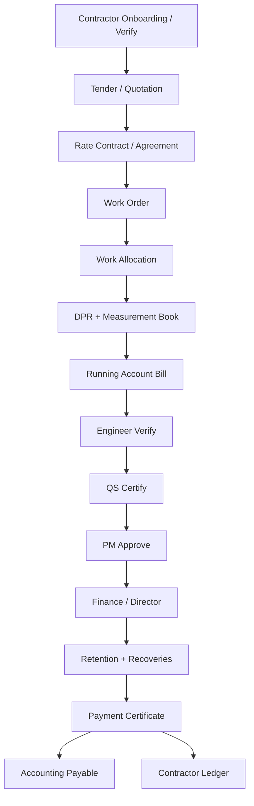

# Contractor Management Architecture (Phase 6)

**Principle:** Verified site execution (Phase 5) is the input; contractor commercial instruments convert certified/verified quantities into immutable liabilities, recoveries, retention, and payables. Approved commercial terms are never silently overwritten — amendments create revision history.

**Baseline:** Phase 5 Site Execution complete. DPR index migration applied (`SE-dpr-index-migration.md`).

## Core flow



## Hierarchy

```
Company
  └── Contractor (master)
        ├── Rate Contract (company-wide or project)
        └── Project
              └── Work Order
                    ├── Amendments (revision trail)
                    ├── Measurement Book entries
                    └── Running Bills → Payment Certificates → Ledger
```

## Modules

| Module | Path | Role |
|--------|------|------|
| Contractors | `contractors` (extend) | Master, compliance, blacklist, contacts, performance |
| Tenders | `contractor-tenders` (**new**) | Invite, tech/commercial bid, comparison, award |
| Rate contracts | `rate-contracts` (**new**) or extend `contractor-agreements` | BOQ/labour/material/equipment rates, retention, LD |
| Work orders | `work-orders` (**new**) | Lifecycle + amendments |
| Measurement book | `measurement-book` (**new** or extend WM) | Billing source of truth linked to WO + DPR |
| Running bills | `contractor-bills` (extend) | Calculation engine + payment certificate status |
| Recoveries | `contractor-recoveries` (**new**) | Advances, material, equipment, penalties, TDS |
| Material reconciliation | `contractor-material-reconciliation` (**new**) | Issue − theoretical − wastage − return |
| Retention | `contractor-retention` (**new**) | Deduct / release / BG replace / register |
| Ledger | extend reports + `contractor-ledger` UI | Immutable sub-ledger views |
| Dashboard / reports | `contractor-dashboard`, `contractor-reports` | Ops + director |

## Measurement Book rule

MB (or certified/verified WM linked to WO) is the **only** quantity source for RA bill lines.  
Previously certified quantities cannot be billed twice. Corrections = revision documents, never silent edit.

## Running bill formula

```
Gross Work Value
+ Approved Extras
+ Price Escalation
- Previous Certified Value
- Retention
- Advance Recovery
- Material / Equipment / Labour Recoveries
- Penalties
- TDS (+ GST-TDS if applicable)
- Other statutory / approved manual deductions
+ GST
= Net Payable
```

## Material reconciliation

```
Material Issued to Contractor
- Theoretical Consumption (BOQ / standards)
- Approved Wastage
- Material Returned
= Recoverable Difference → recovery document → RA / ledger
```

Integrates Phase 4 stock ledger + Phase 5 DPR consumption.

## Work order amendments

Quantity/rate/scope/time changes create a new amendment revision with approval.  
Approved WO commercial snapshot is immutable; bill rates resolve from active WO revision.

## Permissions

### Reuse
`contractor.*`, `contractor_agreement.*`, `measurement.*`, `running_bill.*`, `payment.*`, `approval.*`, `document.*`, `stock.view`/`stock.issue`, `dpr.view`, `report.view`, `dashboard.view`

### Add (minimal)
`tender.view|manage|award`  
`rate_contract.view|manage|approve`  
`work_order.view|create|approve|issue|close`  
`contractor_recovery.view|manage`  
`contractor_retention.view|manage|release`  
`contractor_payment_certificate.view|manage`  
`contractor_report.view`  
`contractor_portal.view|respond` (contractor users)

## Security invariants

1. R-003: permission ≠ project ≠ site access  
2. Company isolation on contractor master  
3. Ledger / bill post / payment certificate immutable after post  
4. No parallel IAM  

## Implementation waves

See `CTR-current-state-inventory.md` W1–W9.

## Out of scope (later)

Customer Booking · Accounting deep COA redesign · Director BI — consume Phase 6 payables/events.
