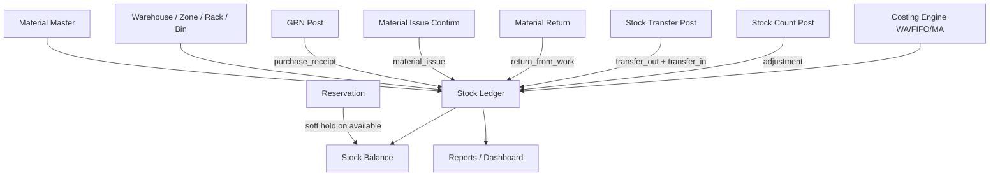

# Inventory Architecture (Phase 4)

**Principle:** The immutable stock ledger is the single source of truth for every material movement. Balances and valuation are derived; never edited directly.

## Flow



## Modules

| Module | Path | Scope |
|--------|------|-------|
| Material master (extended) | `material-master` | Company materials + enterprise flags |
| Warehouse locations | `warehouse-locations` | Zone/Rack/Bin under project warehouse site |
| Stock ledger (extended) | `stock-ledger` | Immutable movements + before/after/value |
| Inventory costing | `inventory-costing` | FIFO layers + WA/MA unit cost |
| Stock transfers | `stock-transfers` | WH/site/project transfers |
| Stock reservations | `stock-reservations` | Soft holds against available qty |
| Inventory barcode | `inventory-barcode` | Generate / resolve QR payloads |
| Inventory dashboard | `inventory-dashboard` | KPIs |
| Inventory reports | `inventory-reports` | Ledger, ageing, ABC, dead stock, etc. |

## Warehouse hierarchy

```
Company → Project → Warehouse (SiteType.warehouse) → Zone → Rack → Bin
```

Warehouse kinds: `main_store`, `site_store`, `temporary_store`, `scrap_yard`, `return_store`, `quarantine_store`.

Location key for balances remains a normalized string path  
`warehouseCode[/zone[/rack[/bin]]]` for backward compatibility with existing `location` field, plus explicit ObjectId refs on ledger rows.

## Costing

Project setting `inventoryCostingMethod`: `weighted_average` (default) | `fifo` | `moving_average`.

- Receipts create/update cost layers (FIFO) or recompute average (WA/MA).  
- Issues consume layers (FIFO) or apply current average.  
- Ledger stores `unitCost`, `totalValue`, `costingMethod`, optional `costLayerIds[]`.

## Permissions (reuse / extend existing)

| Permission | Usage |
|------------|--------|
| `material.view` / `material.manage` | Material master |
| `stock.view` | Ledger, balances, reports, dashboard |
| `stock.adjust` | Manual receipt, adjustment, count post, transfer post |
| `stock.issue` | Issue / return / reservation release |
| `stock.transfer` | Create/submit transfers |
| `stock.reserve` | Create/release reservations |
| `stock.barcode` | Generate / scan |
| `site.manage` | Warehouse + zone/rack/bin config |
| `stock.count.director_approve` | Variance approval (existing) |

## Immutability

`material_stock_transactions` reject update/delete except `reversedById` link. Corrections = reversal entries only.
