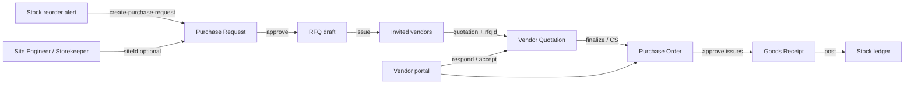

# Procurement Architecture (Phase 3 Backend)

**Baseline:** `cfbc943a4630ad542edde57f9832de9af2dbc2af`  
**Scope:** Backend APIs only (web/mobile UI out of scope). IAM + R-003 project isolation preserved.

## Flow

## Modules

| Module | Path | Scope |
|--------|------|-------|
| Procurement masters | `apps/backend/src/modules/procurement-masters` | `@GlobalScope` company catalogs |
| Purchase requests | `purchase-requests` | `@ProjectScoped` + optional `siteId` / `warehouseSiteId` / `sourceReorderAlertId` |
| Stock reorder → PR | `stock-reorder` | `POST .../alerts/:id/create-purchase-request` |
| RFQ | `rfq` | `@ProjectScoped` draft → issue → close/cancel |
| Vendor quotations | `vendor-quotations` | Optional `rfqId` (vendor must be invited) |
| Procurement dashboard | `procurement-dashboard` | Counts for ops |
| Vendor portal | `vendor-portal` | `Vendor.userId` + `vendor_portal.*` |

## API list

### Procurement masters (`/procurement-masters`, company-scoped)

- `POST /seed-defaults` — payment terms (NET30/NET45/ADVANCE), delivery (EXW/FOR_SITE), tax (GST18/12/5)
- CRUD: `purchase-categories`, `material-categories`, `vendor-categories`, `payment-terms`, `delivery-terms`, `tax-rules`, `preferred-vendors`, `vendor-price-lists`

Permissions: `procurement_master.view|manage` (plus `vendor.manage` / `material.manage` where reused).

### Purchase requests

- Existing PR APIs + optional `siteId`, `warehouseSiteId`, `sourceReorderAlertId`
- Site membership enforced via `SiteAccessService.assertSiteAccessIfScoped` when actor is site-scoped

### MRP → PR

- `POST /stock-reorder/alerts/:id/create-purchase-request` (`purchase.request`)
- Creates draft PR lines from `recommendedPurchaseQuantity`; sets alert `resolved`

### RFQ (`/rfqs`, project-scoped)

- `POST /rfqs`, `GET /rfqs`, `GET /rfqs/:id`, `PATCH /rfqs/:id`
- `POST /rfqs/:id/issue` — status `issued` (email blast stub / log)
- `POST /rfqs/:id/close`, `POST /rfqs/:id/cancel`
- `GET /rfqs/:id/responses` — quotations with matching `rfqId`

Permissions: `quotation.manage` / `quotation.view` / `purchase.order` (close).

### Vendor quotations

- `POST /vendor-quotations` accepts optional `rfqId`; validates vendor invited on issued RFQ

### Dashboard

- `GET /procurement/dashboard?projectId=`  
  Returns: `pendingPr`, `pendingRfq`, `pendingQuotations`, `pendingApprovals`, `openPo`, `delayedPo`, `grnDraft`, `budgetUtilization` (null placeholder)

Permissions: `dashboard.view` **and** `purchase.view` (ProjectScoped filter).

### Vendor portal (`/vendor-portal`)

Requires `Vendor.userId` linked to actor + permissions (not granted to SITE_ENGINEER):

- `GET /rfqs` — issued RFQs where vendor invited (`vendor_portal.view`)
- `POST /rfqs/:id/quotations` — draft quotation as that vendor (`vendor_portal.respond`)
- `GET /purchase-orders` — issued POs for vendor
- `POST /purchase-orders/:id/accept` — sets `vendorAcceptedAt`

## Role seed deltas

| Role | Added |
|------|-------|
| STOREKEEPER | `purchase.request`, `grn.approve` |
| PROJECT_MANAGER | `purchase.approve` |
| PURCHASE_MANAGER / PURCHASE_EXECUTIVE | `procurement_master.view`, `procurement_master.manage` |
| SUPER_ADMIN | all (via `ALL`) |

## Isolation

- Masters: companyId from authenticated actor
- Operational docs: project access via `ProjectScopedDataHelper` / `@ProjectScoped`
- Site PR: site must belong to PR project; site-scoped actors checked via site assignments
