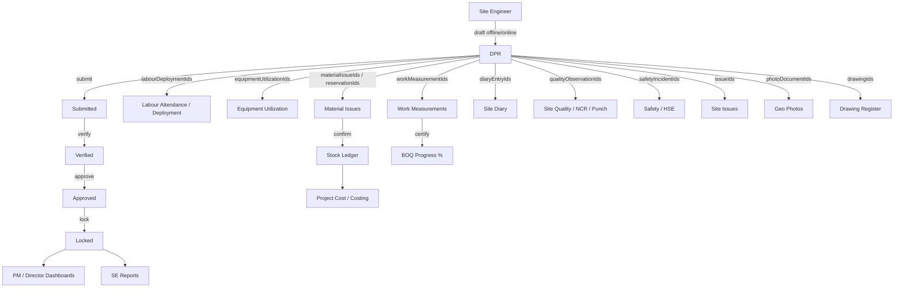

# Site Execution Architecture (Phase 5)

**Principle:** The Daily Progress Report (DPR) is the central daily transaction for site operations. Downstream modules (inventory, labour, equipment, measurements, diary, quality, safety, issues, cost, dashboards) are driven by DPR lifecycle events — not maintained as disconnected forms.

**Baseline:** Phase 4 inventory complete (`INV-architecture.md`). IAM + R-003 + project/site assignment unchanged.

## Hierarchy

```
Company
  └── Project
        └── Site
              └── Daily Site Operations (keyed by date + shift)
                    ├── DPR          ← operational engine
                    ├── Labour
                    ├── Equipment
                    ├── Material Consumption  → Stock Ledger → Project Cost
                    ├── Work Measurements
                    ├── Progress
                    ├── Quality
                    ├── Safety
                    ├── Delays
                    ├── Site Diary
                    ├── Weather
                    ├── Visitors
                    ├── Photos
                    ├── Drawings
                    └── Issues
```

Location dimensions on execution documents (where applicable):

`projectId` → `siteId` → zone / block / tower / floor / unit (+ `shift`, `reportDate`)

Mapped to existing `SiteType`: `site | phase | block | tower | floor | work_area` (+ warehouses for stock).

## Core flow — DPR as engine



### Lifecycle rules

| Status | Editable | Side effects |
|--------|----------|--------------|
| `draft` | Yes (author + assignees) | Soft reservations optional |
| `submitted` | No (except reject → draft) | Notify verifiers |
| `verified` | No | Engineer/PM sign-off recorded |
| `approved` | No | **Post hard effects:** confirm material issues / consume stock, finalize labour & equipment rollups, update progress snapshots, create/link diary + issue children if pending |
| `locked` | No | Immutable snapshot; corrections via controlled reopen → amend → re-approve (or reversal docs), never silent edit |

**Migration from current statuses:**  
`draft` unchanged → `submitted` unchanged → map `reviewed` → `approved` (or insert `verified` before approve) → add `locked`. Keep `reopened` as controlled unlock path for Locked/Approved, with audit reason.

**Uniqueness (target):**  
`(projectId, siteId, reportDate, shift)` unique among non-deleted DPRs.  
Deprecate `uniq_dpr_project_date` after backfill (`siteId` required for new DPRs; legacy rows get project's primary site).

## Modules

| Module | Path (target) | Role |
|--------|---------------|------|
| Daily progress reports | `daily-progress-reports` (extend) | Engine document + workflow + section refs |
| Labour attendance / deployment | `labour-attendance`, `labour-categories` (extend) | Check-in/out, OT, shift, contractor, category → DPR |
| Equipment | `equipment` (**new**) | Master, allocation, fuel, maintenance, breakdown, utilization |
| Material issues / stock | `material-issues`, `stock-reservations`, `stock-ledger` (reuse) | Only path for consumption; no manual balance edit |
| Work measurements | `work-measurements` (extend) | Sheet → verify → approve; link DPR + BOQ + drawing |
| Site diary | `site-diary` (**new**) | Meetings, delays, visitors, instructions, risks |
| Site quality | `site-quality` (**new**) | Inspection, NCR, punch, rectification, re-inspection (≠ GRN QC) |
| Safety / HSE | `site-safety` (**new**) | Near miss, accident, PPE, toolbox talk, safety inspection |
| Site issues | `site-issues` (**new**) | Delay, shortage, equipment failure, design clarification |
| Photos | `documents` + `site-photos` (**extend/new**) | Geo, timestamp, version; link types |
| Drawings | `drawings` (**new**) | Revision, supersede, site access, markup |
| SE dashboard | `site-execution-dashboard` (**new** or extend site ops) | PM + Director views |
| SE reports | `site-execution-reports` (**new** or extend construction-reports) | Register suite |

## DPR document shape (target)

Header: `projectId`, `siteId`, location refs (zone/block/tower/floor/unit), `reportDate`, `shift`, weather, status, audit actors.

Sections (prefer **IDs + denormalized snapshot** over pure narrative):

| Section | Storage |
|---------|---------|
| Work completed / planned / delayed | Structured lines + optional free text |
| Labour deployed | Refs to attendance/deployment rows + category totals |
| Equipment used | Refs to utilization rows (`equipmentId`, hours, idle, breakdown) |
| Material consumed | Refs to material-issue / reservation IDs + qty snapshot |
| Weather | Enum + notes (existing) |
| Safety / quality | Refs to HSE / site-quality docs (+ short embedded summary for PDF) |
| Visitors | Diary or embedded visitor lines |
| Photos / drawings | `documentId` / `drawingId` arrays |
| Issues | Refs to `site-issues` |
| Remarks | Free text |

Embedded narrative fields (`materialsIssued[]` as text, `equipmentUsed[]` name-only, `safetyIssues[]` text) remain for PDF/legacy but **must not** be the only source of truth once W2+ lands.

## Material consumption (inventory integration)

```
Cement 200 bags on DPR
  → stock reservation (sourceType: dpr, sourceId: dprId)   [draft/submit]
  → material issue draft lines linked to dprId
  → on DPR approve: POST material-issues/:id/confirm
  → stock ledger material_issue (immutable)
  → costing engine (WA/FIFO/MA from Phase 4)
  → project cost / future contractor billing hook
```

Rules:

- No direct stock balance edit from Site Execution UI.  
- Reopen/lock corrections use issue return or ledger reversal patterns from INV.  
- Site/warehouse access enforced via existing `SiteAccessService` + `stock.issue` / `stock.reserve`.

## Labour

- Contractors: reuse contractor master where present; deployment rows carry `contractorId`.  
- Categories: Skilled / Semi-skilled / Unskilled (extend labour-categories seed).  
- Attendance: check-in, check-out, OT hours, shift; confirm path keeps `attendance.confirm`.  
- DPR shows daily deployment rollup; approve freezes counts for payroll/billing downstream.

## Equipment

New aggregate:

- Master (code, type, ownership hire/own, status)  
- Allocation to project/site  
- Fuel logs, maintenance, breakdown  
- Utilization lines linked to DPR (hours worked / idle)

Gated by project setting `equipmentEnabled` until module ships.

## Work measurement & progress

- BOQ item + unit + quantity + measurement sheet  
- Engineer verification → approval (`measurement.certify` + optional approve step)  
- Certified qty updates BOQ progress; DPR.approve snapshots physical progress for the day  
- Drawing reference becomes `drawingId` when register exists

## Quality vs GRN QC

| Concern | Module | Permissions |
|---------|--------|-------------|
| Vendor / inbound QC | `quality-inspections` (existing) | `quality.view`, `quality.inspect` |
| Site workmanship | `site-quality` (new) | Prefer `site_quality.*` — do not overload GRN inspect |

Flow: Inspection → NCR → Punch List → Rectification → Re-inspection.

## Safety

First-class HSE events: Near Miss, Accident, PPE check, Toolbox Talk, Safety Inspection.  
DPR section links IDs; critical severity can open `site-issues` automatically.

## Issues

Types: delay, material shortage, labour shortage, equipment failure, design clarification (+ other).  
Workflow: Open → Assigned → Resolved → Closed.  
Permissions: `site_issue.view|create|assign|close` (names TBD in catalog).

## Photos & drawings

- Photos: lat/lng, capturedAt, version/revision, links `{ dpr | work | issue | quality | safety }`  
- Drawings: latest revision flag, supersededBy, site access ACL, markup overlays stored as documents  

Reuse `document.*` for binary storage; domain metadata in SE modules.

## Mobile (Site Engineer)

Must support offline (existing enqueue patterns):

Create DPR · Scan materials · Record labour · Record equipment · Upload photos · Record measurements · Submit DPR  

Sync conflicts: reuse Phase 131 conflict centre patterns; idempotency keys already on DPR.

## Dashboards

| Audience | KPIs |
|----------|------|
| Project Manager | DPR completion %, labour headcount, equipment utilization, material consumed vs plan, delays, open issues |
| Director | Physical progress %, financial progress %, daily productivity, critical issues |

Reuse `dashboard.view` + domain view permissions; project-scoped.

## Reports

DPR Register · Labour · Equipment Utilization · Material Consumption · Daily Progress · Delay · Quality · Safety · Productivity  

Prefer ledger / attendance / certified measurement sources over re-keyed narrative.

## Permissions (reuse / extend)

### Reuse (do not duplicate)

| Permission | Usage |
|------------|--------|
| `dpr.view` / `dpr.create` / `dpr.review` | Extend review to cover verify/approve/lock; add `dpr.approve` / `dpr.lock` only if role split requires it |
| `attendance.*` | Labour |
| `measurement.*` | Work measurement |
| `stock.view` / `stock.issue` / `stock.reserve` | Consumption path |
| `material.view` | Material pickers |
| `document.*` | Photos / attachments |
| `site.view` / `site.manage` / `site_access.*` | Structure + ACL |
| `quality.view` / `quality.inspect` | GRN QC only |
| `dashboard.view` | Dashboards |
| `manpower_plan.*` / `manpower_shortfall.*` | Planning |

### Likely new (minimal)

| Permission | Usage |
|------------|--------|
| `equipment.view` / `equipment.manage` / `equipment.operate` | Equipment module |
| `site_diary.view` / `site_diary.manage` | Diary |
| `site_quality.view` / `site_quality.manage` / `site_quality.close` | Site QC / NCR |
| `safety.view` / `safety.manage` | HSE |
| `site_issue.view` / `site_issue.create` / `site_issue.assign` / `site_issue.close` | Issues |
| `drawing.view` / `drawing.manage` | Drawing register |

Seed roles: `SITE_ENGINEER` create/submit; PM/SE lead verify/approve; Director lock/view critical; Storekeeper remains stock confirm where split from DPR approve.

## Security invariants

1. Permission ≠ project access ≠ site access (R-003 + site assignment).  
2. All new controllers `@ProjectScoped`; site-scoped fields call `assertSiteAccessIfScoped`.  
3. Stock mutations only through ledger-backed services.  
4. Locked DPR is immutable; financial/stock corrections via reversal documents.  
5. No parallel IAM.

## Implementation waves

See `SE-current-state-inventory.md` W1–W9.  
**Do not** build equipment/drawings/HSE before W1–W2 — without site-scoped DPR + inventory wiring, new modules stay disconnected forms.

## Out of scope (later roadmap)

Contractor Management · Customer Booking · Accounting · BI — consume SE outputs (progress, consumption, labour, issues) but are not Phase 5 deliverables.
